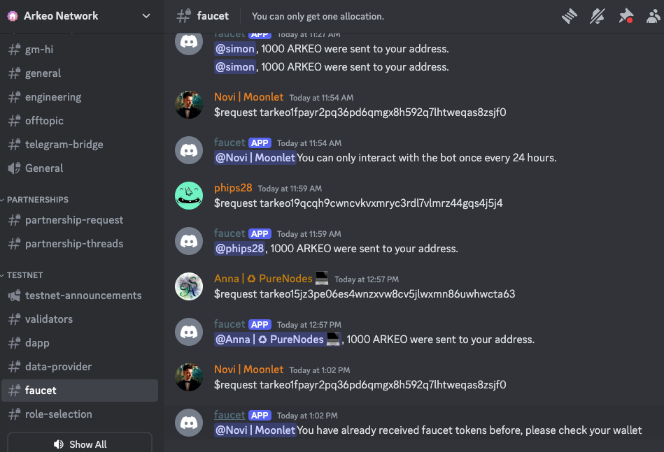

# Setup Validator
Becoming a validator involves running node and staking arkeo tokens to participate in network consensus 

## Prerequisites

- [Prerequisites](./TESTNET.md#prerequisites) 
- [Configure Binary](./TESTNET.md#arkeo-binary)
- [Start Node](./TESTNET.md#configure-service)


## Setting Up Wallet 
```shell
arkeod keys add <your-wallet-name>
```
> For the new account balances wont be there if you're running a testnet validator please request tokens from the faucet 

### Request Tokens From Faucet
To receive test tokens, follow these steps:

1. **Join the Discord Server**:
   - Navigate to the official [Discord server](https://discord.com/invite/BfEHpm6uFc) for the testnet.

2. **Find the Faucet Channel**:
   - In the Discord server, go to the **TESTNET** branch and select the **faucet** channel.

3. **Request Tokens**:
   - In the **faucet** channel, type the following command:
     ```
     $request <YOUR_WALLET_ADDRESS>
     ```
   - Replace `<YOUR_WALLET_ADDRESS>` with the address you created in the previous step.
     

The faucet will send tokens to your wallet for use on the testnet.


### Check the balances 
```shell
arkeod query bank balances $(arkeod keys show <your-wallet-name> -a)
```

## Create A Validator
> Don’t change anything if you don’t understand what you’re doing.

```shell
arkeod tx staking create-validator \
--chain-id arkeo \
--commission-rate 0.05 \
--commission-max-rate 0.2 \
--commission-max-change-rate 0.1 \
--min-self-delegation "1" \
--amount <staking amount>uarkeo \
--pubkey $(arkeod tendermint show-validator) \
--moniker "<your-validator-name>" \
--from <your-wallet-name> \
--fees="5000uarkeo" \
--yes
```

## Restart the Service
Check the node logs 
```shell
journalctl -u arkeod -f -o cat
```

Restart the Node
```shell
sudo systemctl restart arkeod
```

Check your node status here;
```shell
curl http://127.0.0.1:26657/status
```

Check node synchronization, if results false – node is synchronized

```shell
curl -s http://127.0.0.1:26657/status | jq .result.sync_info.catching_up
```

## Additionally To Bond More Tokens
Get your valoper address:

```shell
arkeod keys show wallet --bech val -a
```

Bond more tokens (if you want to increase your validator stake you should bond more to your valoper address):

```shell
arkeod tx staking delegate YOUR_VALOPER_ADDRESS <token amount to stake>uarkeo --from wallet --chain-id $CHAIN_ID --fees="500uarkeo"
```

## Check Validators Status
Active validators list

```shell
arkeod query staking validators -o json | jq -r '.validators[] | select(.status=="BOND_STATUS_BONDED") | [.operator_address, .status, (.tokens|tonumber / pow(10; 8)), .description.moniker] | @csv' | column -t -s"," | sort -k3 -n -r
```
Inactive validators list

```shell
arkeod query staking validators -o json | jq -r '.validators[] | select(.status=="BOND_STATUS_UNBONDED") | [.operator_address, .status, (.tokens|tonumber / pow(10; 8)), .description.moniker] | @csv' | column -t -s"," | sort -k3 -n -r
```

## Remove Node:
```shell
systemctl stop arkeod
sudo systemctl disable arkeod
sudo rm -rf ~/.arkeod /etc/systemd/system/arkeod.service
```